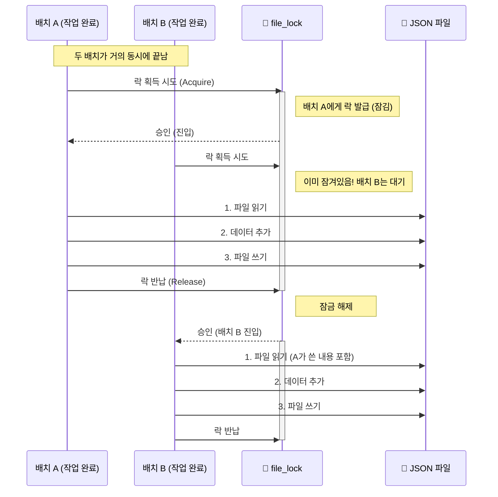

웹 크롤링이나 API를 활용해 수천, 수만 건의 데이터를 처리하다 보면 `for` 문 하나로는 한계에 부딪힌다. 

이 글에서는 파이썬의 **비동기 프로그래밍**에 관한 개념부터 **대량 데이터 처리 파이프라인(Pipeline)** 설계 방법까지 단계별로 정리하였다. 특히 Google Gemini API와 같은 고성능 LLM을 효율적으로 다루는 방법을 예제로 다룬다.

---

# 1. 비동기 프로그래밍이란?

우선, 비동기를 이해하기 위해선 먼저 컴퓨터가 일을 처리하는 방식의 병목(Bottleneck)의 원인에 대한 이해가 필요하다.

## 1.1 배경 지식: 병목의 원인 (Bottleneck)

#### I/O Bound vs CPU Bound

- **I/O Bound (입출력 중심):** 프로그램 실행 시간의 대부분을 **'대기'** 하는 데 쓰는 경우.    
	- 예시: 웹페이지 다운로드, DB 쿼리 실행, 파일 읽기/쓰기, API 요청 대기.        
	- 해결: 비동기 프로그래밍(Asyncio)이 가장 효과적이며, 기다리는 동안 다른 일을 하면 된다.        
- **CPU Bound (연산 중심):** CPU가 쉬지 않고 **'계산'** 하는 데 시간을 쓰는 경우.
	- 예시: 머신러닝 학습, 동영상 인코딩, 암호화폐 채굴, 복잡한 수학 연산.
	- 해결: 비동기보다는 멀티 프로세싱(Multi-processing)으로 코어 여러 개를 동시에 쓴다.
      

#### 블로킹(Blocking) vs 논블로킹(Non-blocking)

- **블로킹 (Blocking):** 전통적인 함수 호출 방식으로 제어권을 강탈
	- 예시: `requests.get()`을 호출하면 응답이 올 때까지 프로그램이 멈춘다.
	- "이거 다 될 때까지 꼼짝 말고 기다려."
- **논블로킹 (Non-blocking):** 특정 행동이 끝나면 제어권을 돌려 받음
	- `aiohttp`, `asyncio` 등이 사용하는 방식.
	- "일단 던져놓고, 너 할 거 해. 다 되면 알려줄게."
        
## 1.2 그래서 비동기 프로그래밍이란?

> **_비동기 프로그래밍(Asynchronous Programming) 작업 요청(Request)과 결과 처리(Response)를 분리하여, 대기 시간(Latency) 동안 유휴 자원(CPU)을 낭비하지 않고 다른 작업을 처리하는 기법_**

==비동기 프로그래밍의 핵심은 "동시성(Concurrency)"의 극대화==이다. 단, 물리적 병렬이랑 오해하면 안된다.

다시 말해, 한 번에 여러 개를 '물리적'으로 실행하는 것(Parallelism)이 아니라, 하나가 멈추면 재빨리 다른 걸 실행해서 **'동시에 하는 것처럼 보이게'** 만드는 기술이다.

---

## 2. Python 활용 방법

> **_Python 내 `asyncio` 라이브러리를 이용_**

## 2.1 핵심 키워드

- **`async def`**: **코루틴(Coroutine)** 함수를 정의한다. 이 함수는 호출해도 바로 실행되지 않고 '실행 가능한 객체'를 반환한다.    
- **`await`**: "이 작업 끝날 때까지 기다릴게(근데 그냥 멍 때리는 게 아니라 제어권은 딴 놈한테 넘겨줄게)"라는 뜻이다. `async` 함수 안에서만 쓸 수 있다.

## 2.2 주요 함수 (Must-Know)

1. **`asyncio.gather(*tasks)`**: 여러 비동기 작업을 **동시에 시작**하고, 모두 끝날 때까지 기다린다. 결과값은 입력 순서대로 리스트로 반환된다.
	1. 활용: 이미지 100장 다운로드를 한 번에 시킬 때.
2. **`asyncio.Semaphore(n)`**: **동시 실행 개수를 제한**하는 문지기.
	1. 활용: API 서버에서 "1초에 5번만 요청해"라고 제한할 때, 동시에 100개를 던지지 않고 5개씩만 실행되도록 조절한다.
3. **`loop.run_in_executor(None, func, args)`**: 동기 함수(Blocking I/O)를 비동기 세상에서 쓸 때 사용한다.
	1. 활용: `genai.upload_file`이나 `time.sleep`처럼 실행하면 코드를 멈추게 하는 함수들을 별도 스레드(Thread)로 보내서 메인 루프가 멈추지 않게 한다.
        

---

# 3. 활용 사례: Gemini API 를 이용한 고성능 API 처리 전략

> **_단순 비동기 호출을 넘어, 상용 API(Google Gemini 등)를 비용 효율적으로, 그리고 제한(Rate Limit)에 걸리지 않고 사용하는 사례_**

### 3.1 컨텍스트 캐싱 (Context Caching)

LLM을 사용할 때 가장 큰 비용은 **입력 토큰(Input Token)**이다. 매번 똑같은 시스템 프롬프트("너는 건축 전문가야...블라블라")를 보내는 것은 엄청난 낭비다.

- **개념:** 무거운 프롬프트나 참고 자료를 구글 서버에 **'미리 저장(Cache)'** 해두고, 요청할 때는 ID만 보내는 기술.
    
- **장점:**
    
    1. **비용 절감:** 캐시된 입력 토큰 비용은 일반 입력보다 훨씬 저렴(약 70~90% 할인)하다.
        
    2. **속도 향상:** 서버가 긴 텍스트를 매번 읽을 필요가 없어 처리 속도가 빨라진다.
        
- **코드 예시:**

```python
from google.generativeai import caching
cache = caching.CachedContent.create(
	model="models/gemini-3.",
	system_instruction=LONG_SYSTEM_PROMPT, # 2000토큰
	ttl=datetime.timedelta(minutes=60)     # 60분간 유효
)    
```  
    

### 3.2 배치 처리 (Batch Processing)

API 요청 횟수 제한(Rate Limit)을 우회하고 효율을 높이는 핵심 기술이다.


Shutterstock

- **배치(Batch)란?**: 데이터를 하나씩 처리(Sequential)하지 않고, **N개씩 묶음(Block)으로 만들어 한 번에 처리**하는 것.
    
- **Gemini에서의 활용:**
    
    - **RPD (Requests Per Day) 우회:** 하루 250회 요청 제한이 있다면, 1회 요청에 이미지를 1장씩 보내면 250장밖에 못 한다. 하지만 **1회 요청에 20장을 묶어서(Batch)** 보내면? -> **5,000장 처리 가능!**
        
    - **토큰 관리:** 배치 사이즈를 무작정 늘리면 안 된다. 모델의 **Max Output Tokens(최대 출력 토큰)** 제한에 걸려 답변이 잘릴 수 있기 때문.
        
        - _Gemini 1.5 Pro (8k 출력):_ 배치 5~8 권장.
            
        - _Gemini 3.0 Pro (64k 출력):_ 배치 20~50 가능.
            

### 3.3 안정적인 파이프라인 설계 (Best Practice)

대량의 데이터를 처리하는 코드는 다음 3가지 요소를 반드시 갖춰야 한다.

1. **`asyncio.Semaphore`**: API 서버가 받아줄 수 있는 속도(RPM)에 맞춰 동시 요청 수를 물리적으로 제한한다.
    
2. **`await asyncio.sleep`**: 요청 간 안전 마진(Interval)을 두어 429(Too Many Requests) 에러를 방지한다.
    
3. **`run_in_executor`**: 파일 업로드 같은 I/O 작업이 비동기 흐름을 막지(Block) 않도록 별도 스레드에서 실행한다.
    

---

## 4. 최종 코드 아키텍처 (Python Template)

위 개념들을 모두 적용한 **'비동기 배치 처리기'** 의 템플릿이다.

```python
import asyncio
import sys
# Windows 'Event loop is closed' 에러 방지
if sys.platform == 'win32':
    asyncio.set_event_loop_policy(asyncio.WindowsSelectorEventLoopPolicy())

async def process_batch(semaphore, model, batch_data):
    async with semaphore: # 1. 동시 실행 수 제한 (문지기)
        await asyncio.sleep(3.0) # 2. 속도 조절 (과속 방지턱)
        
        loop = asyncio.get_running_loop()
        # 3. Blocking 함수(업로드)를 Non-blocking으로 변환
        uploaded_file = await loop.run_in_executor(None, sync_upload_func, file_path)
        
        # 4. 모델 호출 (비동기)
        response = await model.generate_content_async([uploaded_file, prompt])
        return response

async def main():
    # ... (데이터 로드 및 배치 분할) ...
    
    # 5. 작업 스케줄링
    semaphore = asyncio.Semaphore(5) # 동시에 5개 배치만 실행
    tasks = [process_batch(semaphore, model, b) for b in batches]
    
    # 6. 실행 및 시각화 (tqdm)
    results = await tqdm.gather(*tasks)
```

### 배치 사이즈 결정 공식

$$\text{최적 배치 사이즈} \approx \frac{\text{모델 최대 출력 토큰 (예: 8,192)}}{\text{데이터 1개당 예상 출력 토큰 (예: 1,000)}}$$

- 너무 크면: 답변이 잘림 (Truncated).    
- 너무 작으면: API 호출 횟수 낭비.

## 5. 데이터 무결성을 위한 안전장치 (Async Lock)

비동기 프로그래밍으로 속도를 높이다 보면 새로운 문제가 발생한다. 바로 **경쟁 상태(Race Condition)** 다. 여러 개의 배치 작업이 동시에 끝나서 하나의 결과 파일(`result.json`)에 쓰려고 달려들면, 파일 내용이 뒤엉키거나 깨져버릴 수 있다.

이때 필요한 것이 바로 `asyncio.Lock` 이다.

### 5.1 경쟁 상태 (Race Condition)란?

쉽게 말해 **"화장실은 하나인데 사람(작업)이 여러 명인 상황"** 이다.

- **Lock이 없을 때:** A가 화장실에 들어갔는데, B도 문을 벌컥 열고 들어온다. -> **대참사 (데이터 손상)**    
- **Lock이 있을 때:** A가 키를 가지고 들어가서 문을 잠근다(`acquire`). B는 문 밖에서 키가 반납될 때까지 줄 서서 기다린다(`wait`). A가 볼일을 마치고 키를 반납하면(`release`), 그때 B가 들어간다.

### 5.2 `asyncio.Lock` 실전 적용

여러 비동기 태스크가 하나의 공유 자원(파일, 전역 변수 등)을 건드릴 때는 반드시 Lock을 사용해야 한다.

#### 코드 예시: 안전한 파일 저장 함수

```python
import aiofiles
import asyncio
import json
import os

# 1. 전역 락 생성 (단 하나뿐인 화장실 키)
file_lock = asyncio.Lock()

async def append_to_json(file_path: str, new_data: list):
    """
    JSON 파일에 데이터를 안전하게 추가하는 함수
    """
    if not new_data:
        return

    # 2. 락 획득 시도 (async with)
    # 이 블록 안에는 한 번에 오직 하나의 작업만 들어올 수 있다.
    async with file_lock:
        try:
            # 3. 기존 파일 읽기 (Read)
            if not os.path.exists(file_path):
                current_data = []
            else:
                async with aiofiles.open(file_path, "r", encoding="utf-8") as f:
                    content = await f.read()
                    current_data = json.loads(content) if content else []
            
            # 4. 데이터 병합 (Modify)
            current_data.extend(new_data)
            
            # 5. 파일 덮어쓰기 (Write)
            async with aiofiles.open(file_path, "w", encoding="utf-8") as f:
                await f.write(json.dumps(current_data, ensure_ascii=False, indent=2))
                
        except Exception as e:
            print(f"⚠️ 저장 실패: {e}")
    # 6. 블록을 빠져나오면 자동으로 락 반납 (Release)
```

### 5.3 Lock 사용 시 주의사항

- **병목 주의:** Lock을 너무 남발하면 비동기의 장점인 '동시성'이 사라지고, 순차 처리(Sequential)처럼 변해버려 속도가 느려질 수 있다. 공유 자원을 건드리는 **"최소한의 구간(Critical Section)"**에만 Lock을 걸어야 한다.
    
- **데드락(Deadlock) 주의:** 서로가 서로의 키를 기다리며 영원히 멈추는 현상. `asyncio.Lock`은 기본적으로 재진입이 불가능하므로, 락 안에서 또 락을 걸지 않도록 설계해야 한다.
    




---

**정리하며**

대량 데이터 처리는 단순히 `for` 문을 돌리는 것과는 차원이 다르다. **비동기(Asyncio)** 로 CPU를 쥐어짜고, **배치(Batch)** 로 API 효율을 극대화하며, **락(Lock)** 으로 데이터 안정성을 지켜야 한다. 이 세 가지 무기를 손에 쥐었다면, 이제 수만 건의 데이터도 두렵지 않을 것이다.